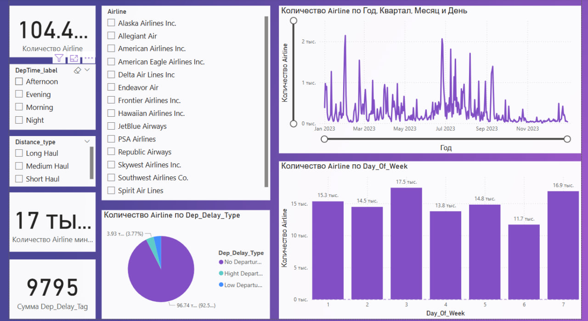

# Power BI: Анализ задержек авиарейсов и активности авиакомпаний

**Цель:** Визуализация ключевых метрик авиаперевозок: задержки вылетов, распределение рейсов по авиакомпаниям, дням недели и типам маршрутов.

## 📊 Основные метрики
- **Общее количество рейсов:** 104.49 тыс.
- **Суммарные задержки вылетов:** 9,795 минут.
- **ТОП-авиакомпании:** Southwest Airlines Co., American Airlines Inc.
- **Распределение по типам маршрутов:** Long Haul, Medium Haul, Short Haul.

## 📂 Данные
- **Источник:** US 2023 Civil Flights, delays, meteo and aircrafts by bordanova.
- **Поля:**
  - `Airline` (15 авиакомпаний).
  - `Dep_Delay_Tag` (задержки вылетов).
  - `Distance_type` (тип маршрута).
  - `Year_Quarter_Month`, `Day_Of_Week`.

## 🛠 Инструменты
- **Power BI:** Создание интерактивного дашборда.
- **DAX-меры:** Расчет суммарных задержек, динамики рейсов.
- **Визуализации:** Столбчатые диаграммы, временные ряды, карточки.

## 🖼 Скриншоты дашборда

## 🔍 Инсайты
1. **Пиковые дни недели:** Наибольшее количество рейсов приходится на середину недели (среда-пятница).
2. **Сезонность:** Рост активности в летние месяцы (июль-сентябрь 2023).
3. **Задержки:** American Airlines Inc. лидирует по суммарным задержкам.

## 🚀 Как использовать проект
1. **Для просмотра:** Откройте файл `airline_analysis.pbix` в Power BI Desktop.
2. **Данные:** Используйте `flight_data.csv` для воспроизведения анализа.
